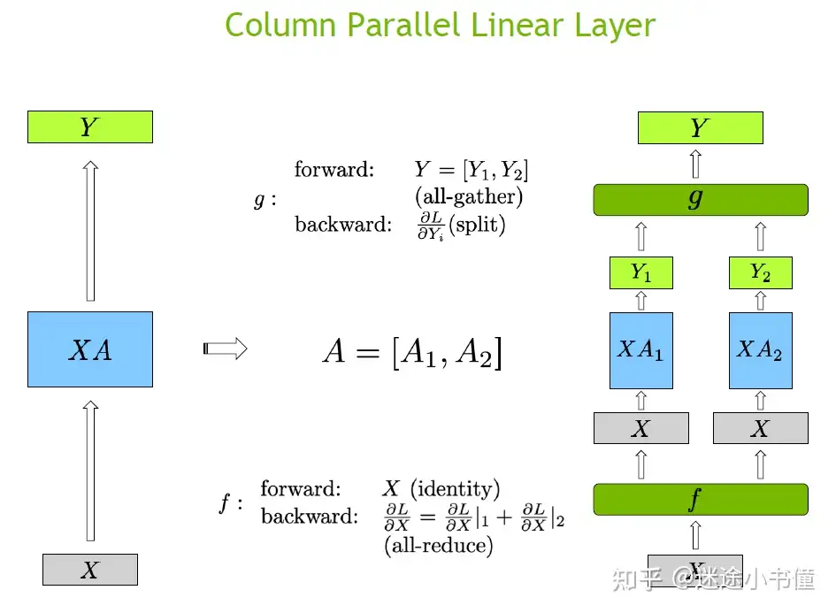
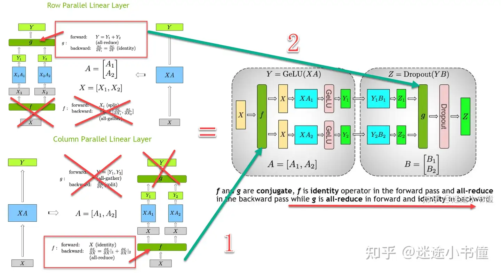
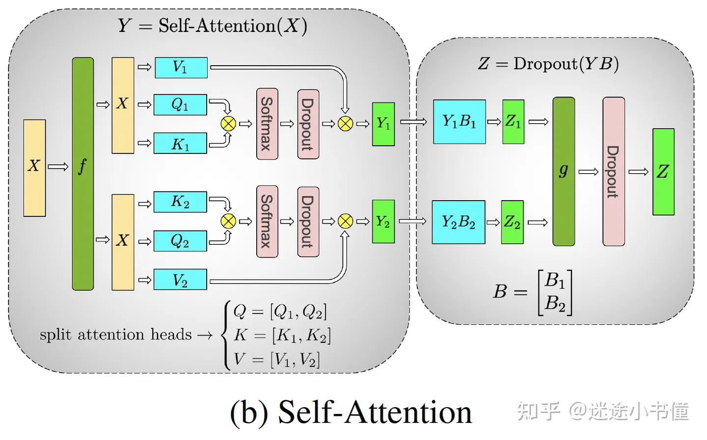

# 1. 数据并行
> 每张GPU上保存一份完整模型，数据切分到每个GPU上前向计算，通过Reduce Scatter方式更新
每一次前向后，进行一次全局通信，更新梯度

在分布式训练中，使用部分全局梯度来更新参数是可行的，主要原因在于以下几个方面：

### 1. **计算效率和通信效率**

- **减少通信量**：在大规模分布式训练中，直接传输完整的全局梯度会带来巨大的通信开销。通过使用 `Reduce Scatter` 等方法，每个节点只需传输和接收一部分梯度，大大减少了通信量，提高了通信效率。
- **并行计算**：部分全局梯度可以在多个节点上并行计算和聚合，进一步加速了梯度聚合过程。

### 2. **梯度的统计性质**

- **梯度的线性组合**：梯度本质上是一个向量，多个梯度的线性组合仍然是一个有效的梯度。即使每个节点只拥有部分全局梯度，这些部分梯度的线性组合仍然可以提供关于参数更新的有效信息。
- **均匀分布**：如果数据和模型参数在各个节点之间均匀分布，那么每个节点计算的部分梯度可以看作是全局梯度的一个无偏估计。这意味着每个节点的部分梯度可以有效地代表整体梯度的某些特征。

### 3. **模型收敛性**

- **收敛性保证**：许多优化算法（如SGD、Adam等）在理论上已经证明，即使使用部分梯度进行更新，模型仍然可以收敛到一个合理的解。这是因为这些算法通常具有较强的鲁棒性，能够处理梯度的噪声和不完整性。
- **动态调整**：在实际训练过程中，可以通过动态调整学习率、批量大小等超参数来进一步提高模型的收敛性和稳定性。

### 4. **实践验证**

- **实验结果**：大量的实验结果表明，使用部分全局梯度进行参数更新在实际应用中是有效的。许多大规模分布式训练系统（如TensorFlow、PyTorch等）都采用了类似的方法，并取得了良好的训练效果。
- **工程实践**：在实际工程实践中，使用部分全局梯度不仅可以提高训练效率，还可以在资源受限的环境下实现高效的模型训练。

### 具体步骤

假设我们有4个节点（节点1、节点2、节点3、节点4），每个节点计算得到的局部梯度分别为 \($\nabla L_1$, $\nabla L_2$, $\nabla L_3$, $\nabla L_4$\)。

1. **局部梯度计算**：
   - 节点1计算得到 \($\nabla L_1$\)
   - 节点2计算得到 \($\nabla L_2$\)
   - 节点3计算得到 \($\nabla L_3$\)
   - 节点4计算得到 \($\nabla L_4$\)

2. **分区和发送**：
   - 节点1将 \(\nabla L_1\) 分成4个部分：\(\nabla L_{1,1}, \nabla L_{1,2}, \nabla L_{1,3}, \nabla L_{1,4}\)
   - 节点2将 \(\nabla L_2\) 分成4个部分：\(\nabla L_{2,1}, \nabla L_{2,2}, \nabla L_{2,3}, \nabla L_{2,4}\)
   - 节点3将 \(\nabla L_3\) 分成4个部分：\(\nabla L_{3,1}, \nabla L_{3,2}, \nabla L_{3,3}, \nabla L_{3,4}\)
   - 节点4将 \(\nabla L_4\) 分成4个部分：\(\nabla L_{4,1}, \nabla L_{4,2}, \nabla L_{4,3}, \nabla L_{4,4}\)

   然后，每个节点将其梯度部分发送给其他节点：
   - 节点1发送 \(\nabla L_{1,1}\) 给节点1，\(\nabla L_{1,2}\) 给节点2，\(\nabla L_{1,3}\) 给节点3，\(\nabla L_{1,4}\) 给节点4
   - 节点2发送 \(\nabla L_{2,1}\) 给节点1，\(\nabla L_{2,2}\) 给节点2，\(\nabla L_{2,3}\) 给节点3，\(\nabla L_{2,4}\) 给节点4
   - 节点3发送 \(\nabla L_{3,1}\) 给节点1，\(\nabla L_{3,2}\) 给节点2，\(\nabla L_{3,3}\) 给节点3，\(\nabla L_{3,4}\) 给节点4
   - 节点4发送 \(\nabla L_{4,1}\) 给节点1，\(\nabla L_{4,2}\) 给节点2，\(\nabla L_{4,3}\) 给节点3，\(\nabla L_{4,4}\) 给节点4

3. **局部聚合**：
   每个节点接收到其他节点发送过来的梯度部分后，将这些部分与其自身的相应部分进行聚合。例如，节点1将接收到的梯度部分 \(\nabla L_{1,1}, \nabla L_{2,1}, \nabla L_{3,1}, \nabla L_{4,1}\) 进行聚合，得到部分全局梯度 \(\nabla L_{1,\text{global}}\)：
   \[
   \nabla L_{1,\text{global}} = \nabla L_{1,1} + \nabla L_{2,1} + \nabla L_{3,1} + \nabla L_{4,1}
   \]

   同理，节点2、节点3和节点4分别计算得到 \(\nabla L_{2,\text{global}}, \nabla L_{3,\text{global}}, \nabla L_{4,\text{global}}\)。

4. **参数更新**：
   每个节点使用其部分全局梯度来更新本地模型的参数。例如，节点1使用 \($\nabla L_{1,\text{global}}$\) 更新参数：
   \[
   $W_1 \leftarrow W_1 - \eta \cdot \nabla L_{1,\text{global}}$
   \]
   其中，\($\eta$\) 是学习率。

### 总结

使用部分全局梯度更新参数在分布式训练中是可行的，因为它能够有效减少通信量、提高计算效率，并且在理论和实践中都得到了验证。通过合理的设计和优化，可以确保模型在分布式环境中高效、稳定地训练。


```python
import torch
import torch.distributed as dist

def train(rank, world_size):
    # 初始化分布式环境
    dist.init_process_group(backend='nccl', init_method='env://', world_size=world_size, rank=rank)
    torch.cuda.set_device(rank)
    
    # 假设每个节点的局部梯度
    local_gradients = torch.tensor([rank * 10 + i for i in range(12)], dtype=torch.float32).cuda(rank)
    
    # 切分梯度
    input_list = [local_gradients[i * 3:(i + 1) * 3] for i in range(4)]
    
    # 创建输出张量
    output = torch.zeros(3, dtype=torch.float32).cuda(rank)
    
    # 执行 reduce_scatter 操作
    dist.reduce_scatter(output, input_list, op=dist.ReduceOp.SUM)
    
    print(f"Rank {rank}: Output = {output}")

    # 清理分布式环境
    dist.destroy_process_group()

# 主函数
def main():
    world_size = 4  # 假设有4个GPU
    import torch.multiprocessing as mp
    mp.spawn(train, args=(world_size,), nprocs=world_size, join=True)

if __name__ == "__main__":
    main()
```

# 2. 模型并行

## 前导知识
### 模型结构

| 参数 | 含义 | 形状 |
|---|---|---|
| L | 损失函数 | N, M |
| Z | 输出结果 | N, M |
| X | 输入参数 | N, D |
| W | 权重 | D, M |

线性层的前向传播公式为：
Z = XW


### 链式法则

$\frac{\partial L}{\partial X} = \frac{\partial L}{\partial Z} \cdot \frac{\partial Z}{\partial X}$

### 输出对输入的偏导数

首先，我们需要计算 \( \frac{\partial Z}{\partial X} \)。根据线性层的前向传播公式 \( Z = XW \)，我们可以写出每个元素的关系：
$Z_{ij} = \sum_{k=1}^{D} X_{ik} W_{kj}$
对于固定的i和j，$Z_{ij}$是关于$X_{ik}$的线性组合。因此，$\frac{\partial Z_{ij}}{\partial X_{ik}} = W_{kj}$。

从而对于某一个$\frac{\partial Z_i}{\partial X_i} = W^T\\$
将这些偏导数组合简化成矩阵形式，我们得到：
$\frac{\partial Z}{\partial X} = W^T$

结合链式法则，我们得到：
$\frac{\partial L}{\partial X} = \frac{\partial L}{\partial Z} \cdot W^T$

### 解释

1. **矩阵乘法**：在矩阵乘法中，如果我们有一个矩阵 \( A \) 形状为 \( (N, M) \) 和一个矩阵 \( B \) 形状为 \( (M, D) \)，那么它们的乘积 \( C = AB \) 的形状为 \( (N, D) \)。
2. **转置的作用**：权重矩阵 \( W \) 的形状为 \( (D, M) \)，其转置 \( W^T \) 的形状为 \( (M, D) \)。这样，当我们将 \( \frac{\partial L}{\partial Z} \)（形状为 \( (N, M) \)）与 \( W^T \) 相乘时，结果的形状为 \( (N, D) \)，与输入特征矩阵 \( X \) 的形状一致。

### 示例

假设我们有一个简单的线性层，输入特征矩阵 \( X \) 的形状为 \( (2, 3) \)，权重矩阵 \( W \) 的形状为 \( (3, 2) \)，输出矩阵 \( Z \) 的形状为 \( (2, 2) \)。

1. **前向传播**：
   \[ Z = XW \]
   其中 \( X \) 和 \( W \) 的具体值如下：
   $$
   X = \begin{pmatrix}
   x_{11} & x_{12} & x_{13} \\
   x_{21} & x_{22} & x_{23}
   \end{pmatrix}
   $$
   $$
   W = \begin{pmatrix}
   w_{11} & w_{12} \\
   w_{21} & w_{22} \\
   w_{31} & w_{32}
   \end{pmatrix}
   $$

2. **输出**：
$$
Z = \begin{pmatrix}
z_{11} & z_{12} \\
z_{21} & z_{22}
\end{pmatrix}
$$
其中：
$$
z_{11} = x_{11}w_{11} + x_{12}w_{21} + x_{13}w_{31} \\
z_{12} = x_{11}w_{12} + x_{12}w_{22} + x_{13}w_{32} \\
z_{21} = x_{21}w_{11} + x_{22}w_{21} + x_{23}w_{31} \\
z_{22} = x_{21}w_{12} + x_{22}w_{22} + x_{23}w_{32}
$$

3. **损失函数对输出的偏导数**：
   $$
   \frac{\partial L}{\partial Z} = \begin{pmatrix}
   \frac{\partial L}{\partial z_{11}} & \frac{\partial L}{\partial z_{12}} \\
   \frac{\partial L}{\partial z_{21}} & \frac{\partial L}{\partial z_{22}}
   \end{pmatrix}
   $$

4. **输入特征矩阵的偏导数**：
   $$
   \frac{\partial L}{\partial X} = \frac{\partial L}{\partial Z} \cdot W^T
   $$
   其中 \( W^T \) 的形状为 \( (2, 3) \)：
   $$
   W^T = \begin{pmatrix}
   w_{11} & w_{21} & w_{31} \\
   w_{12} & w_{22} & w_{32}
   \end{pmatrix}
   $$

   因此：
   $$
   \frac{\partial L}{\partial X} = \begin{pmatrix}
   \frac{\partial L}{\partial z_{11}} & \frac{\partial L}{\partial z_{12}} \\
   \frac{\partial L}{\partial z_{21}} & \frac{\partial L}{\partial z_{22}}
   \end{pmatrix}
   \cdot
   \begin{pmatrix}
   w_{11} & w_{21} & w_{31} \\
   w_{12} & w_{22} & w_{32}
   \end{pmatrix}
   $$
   结果的形状为(2, 3)，与输入特征矩阵X的形状一致。

## 切分
假设输入shape为 (B S H) 权重shape为 (H H)
### 横切权重


前向 Split 维度 H （dp, 1, mp）；权重 (mp, 1)
前向做一次 all-reduce 通信
反向做一次 all-gather 通信
### 纵切权重


$$Y = [Y_1, Y_2] = X\cdot[A_1, A_2]$$
前向计算后做一次 all-gather 通信
反向 Y(S,H) 先做一次Split 维度 S
每个设备各自计算自己部分的权重 做一次 all-reduce
$$
\frac{\partial L}{\partial W_i} = 
\frac{\partial L}{\partial Y_i} \cdot \frac{\partial Y_i}{\partial W_i} =
\frac{\partial L}{\partial Y_i} \cdot X_i^T
$$

### MLP切分
这里有两个线性层
X --> 4h --> GeLU --> Dropout --> h
考虑第一层线性层操作，因为后续涉及非线性操作GeLU，所以权重不能横切（横切后需要线性相加），选择纵切（后续拼接不影响GeLU）
第二层输入已经是纵切了（上一层影响），因此这一层权重选择横切，因为后续涉及Dropout操作，需要对结果进行all-reduce。



### Attention切分



### 代码示例
Megatron—LM

```python
# 简化代码
# megatron/mpu/layers.py
class ColumnParallelLinear(torch.nn.Module):
   def __init__(self, input_size, output_size, bias=True, 
      gather_output=True,
      init_method=init.xavier_normal_, stride=1,
      keep_master_weight_for_test=False,
      skip_bias_add=False):
      # Divide the weight matrix along the last dimension.
      world_size = get_model_parallel_world_size()
      self.output_size_per_partition = divide(output_size, world_size)
      # 权重W shape [h/p, h] 进行计算时，会将W转置
      self.weight = Parameter(torch.empty(
         self.output_size_per_partition, self.input_size,
         device=torch.cuda.current_device(),    
         dtype=args.params_dtype))
   
   def forward(self, input_):
        # 权重纵切之后， 反向需要累加
        # Set up backprop all-reduce.
        input_parallel = copy_to_model_parallel_region(input_)
        # Matrix multiply.

        bias = self.bias if not self.skip_bias_add else None
        output_parallel = F.linear(input_parallel, self.weight, bias)
        if self.gather_output:
            # MLP 进入这个分支
            # All-gather across the partitions.
            output = gather_from_model_parallel_region(output_parallel)
        else:
            # Attention层进入这个分支
            output = output_parallel 
        output_bias = self.bias if self.skip_bias_add else None
        return output, output_bias

class RowParallelLinear(torch.nn.Module):
    """Linear layer with row parallelism.

    The linear layer is defined as Y = XA + b. A is parallelized along
    its first dimension and X along its second dimension as:
               -   -
              | A_1 |
              | .   |
          A = | .   |        X = [X_1, ..., X_p]
              | .   |
              | A_p |
               -   -
    Arguments:
        input_size: first dimension of matrix A.
        output_size: second dimension of matrix A.
        bias: If true, add bias. Note that bias is not parallelized.
        input_is_parallel: If true, we assume that the input is already
                           split across the GPUs and we do not split
                           again.
        init_method: method to initialize weights. Note that bias is always set to zero.
        stride: For the strided linear layers.
        keep_master_weight_for_test: This was added for testing and should be
                                     set to False. It returns the master weights
                                     used for initialization.
        skip_bias_add: This was added to enable performance optimations where bias
                       can be fused with other elementwise operations. we skip 
                       adding bias but instead return it.
    """

    def __init__(self, input_size, output_size, bias=True,
                 input_is_parallel=False,
                 init_method=init.xavier_normal_, stride=1,
                 keep_master_weight_for_test=False,
                 skip_bias_add=False):
         super(RowParallelLinear, self).__init__()

         # Keep input parameters
         self.input_size = input_size
         self.output_size = output_size
         self.input_is_parallel = input_is_parallel
         # Divide the weight matrix along the last dimension.
         world_size = get_model_parallel_world_size()
         self.input_size_per_partition = divide(input_size, world_size)
         self.skip_bias_add = skip_bias_add
   
         # Parameters.
         # Note: torch.nn.functional.linear performs XA^T + b and as a result
         # we allocate the transpose.
         # Initialize weight.
         args = get_args()
         # W shape [h, h/p]
         self.weight = Parameter(torch.empty(
             self.output_size, self.input_size_per_partition,
             device=torch.cuda.current_device(), dtype=args.params_dtype))
         _initialize_affine_weight_gpu(self.weight, init_method,
                                          partition_dim=1, stride=stride)
        if bias:
            self.bias = Parameter(torch.empty(
                self.output_size, device=torch.cuda.current_device(),
                dtype=args.params_dtype))
            # Always initialize bias to zero.
            with torch.no_grad():
                self.bias.zero_()
        else:
            self.register_parameter('bias', None)


    def forward(self, input_):
        # Set up backprop all-reduce.
        if self.input_is_parallel:
            # 正常进入该分支 input shape [b, s, h/p]
            input_parallel = input_
        else:
            # 未设置sactter 最后一维
            input_parallel = scatter_to_model_parallel_region(input_)
        # Matrix multiply.
        output_parallel = F.linear(input_parallel, self.weight)
        # All-reduce across all the partitions.
        output_ = reduce_from_model_parallel_region(output_parallel)
        if not self.skip_bias_add:
            output = output_ + self.bias if self.bias is not None else output_
            output_bias = None
        else:
            output = output_
            output_bias = self.bias
        return output, output_bias
```

